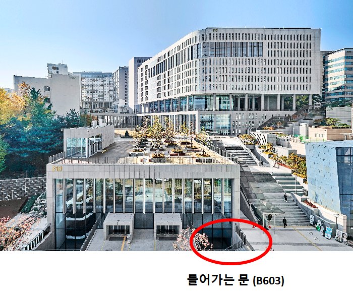
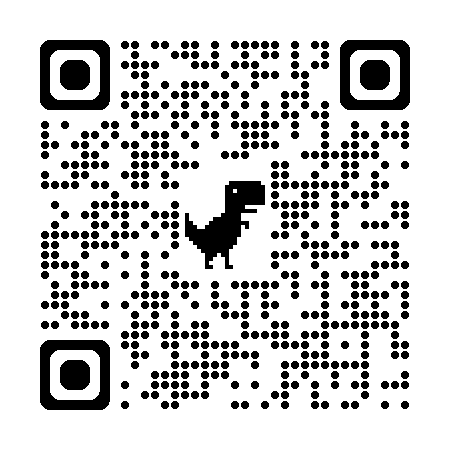

# 시스템화학 연구센터 1차년도 동계 워크숍

- 일시: 2025년 2월 25-26일 (화-수)
- 장소: 중앙대학교310 관 B6 603호
  
    - [**네이버 지도 링크**](https://naver.me/5k7wIQFF)
    
    - [**카카오맵 링크**](https://place.map.kakao.com/359179858)

 ### (이 문으로 들어가면 B5층으로 들어갑니다. 여기에서 한층 아래 내려오시면 됩니다.)

- 프로그램북 링크: [**링크**](https://github.com/thereexist/GCSC_winter_2025/blob/main/%EC%8B%AC%ED%8F%AC%EC%A7%80%EC%97%84%20%ED%94%84%EB%A1%9C%EA%B7%B8%EB%9E%A8%EB%B6%81.pdf)

